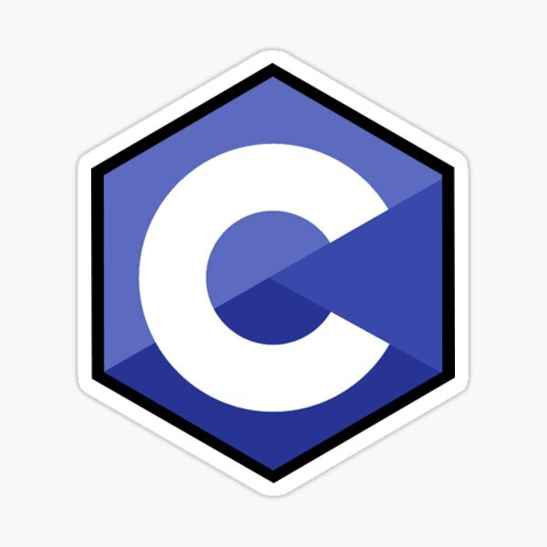

# I love C



Welcome to my C Programming Practice Repository! This repository is dedicated to my journey in learning and practicing the C programming language. Here, you'll find a collection of programs, exercises, and projects that I've worked on to enhance my understanding of C.

## Getting Started

To get started with this repository, clone it to your local machine using the following command:

```sh
git clone https://github.com/your-username/I-love-C.git
